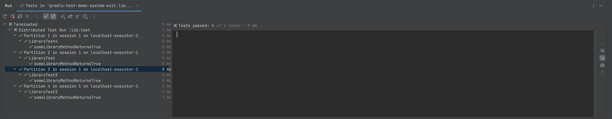
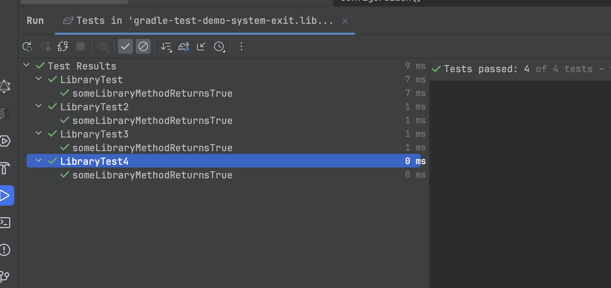

This project shows how running tests with [Gradle Test Distribution](https://docs.gradle.com/enterprise/test-distribution/)
in [Jetbrains IntelliJ](https://www.jetbrains.com/idea/) results in improper grouping of tests in the test runner UI.

## Steps to reproduce

1. Clone this repository
2. Open it in IntelliJ
3. Run the `test` task from the Gradle tool window

You will see

## Expected behavior

The tests should be grouped by the test class, not by the Partition/Session:

